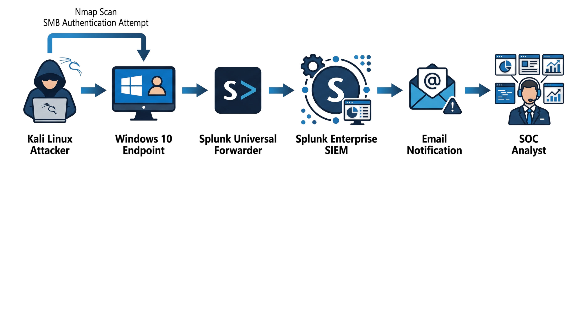
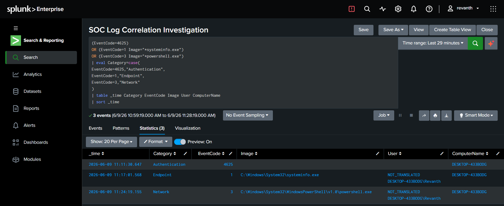
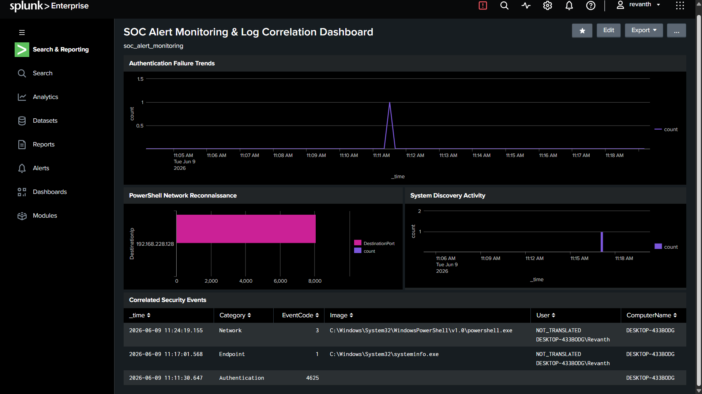
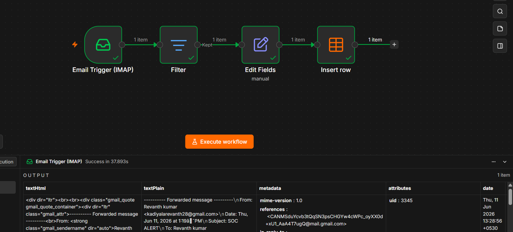
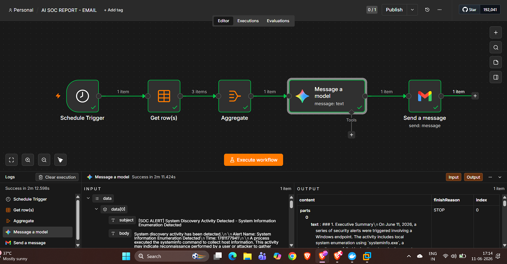
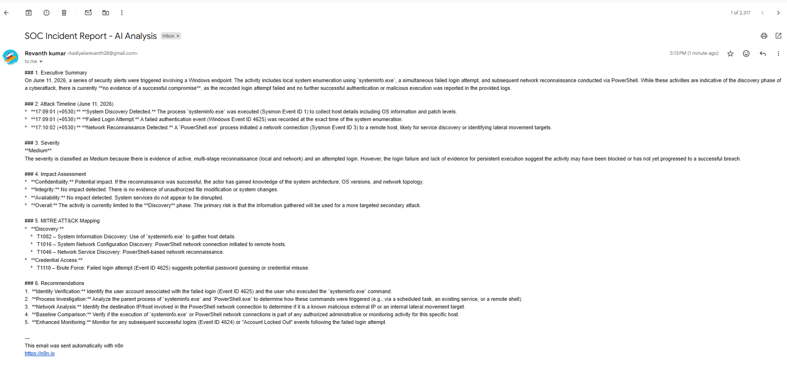

# SOC Alert Monitoring and Log Correlation Using Splunk and Sysmon

## Project Overview

This project demonstrates the implementation of a Security Operations Center (SOC) monitoring environment using Splunk Enterprise and Sysmon. The solution collects authentication, endpoint, and network logs, generates real-time alerts, correlates security events, and demonstrates the investigation workflow followed by SOC analysts.

## Technologies Used

* Splunk Enterprise
* Sysmon
* Splunk Universal Forwarder
* Windows 10
* Kali Linux
* n8n
* Google Gemini

## Architecture

## Security Alerts Implemented

### 1. Failed Login Detection

* Windows Event ID 4625
* Detects failed authentication attempts

### 2. System Information Enumeration

* Sysmon Event ID 1
* Detects execution of systeminfo.exe

### 3. PowerShell Network Reconnaissance

* Sysmon Event ID 3
* Detects PowerShell network activity

## Log Correlation

The correlated timeline demonstrates:

Failed Login → System Discovery → Network Reconnaissance

## Dashboard Monitoring

## AI-Powered Incident Reporting

Workflow:

## Project Outcomes

* 3 Security Alerts Generated
* Security Monitoring Dashboard
* Log Correlation Investigation
* Email Notification System
* AI-Assisted Incident Reporting

## Author

Kadiyala Revanth Kumar

Cybersecurity Student | SOC Analyst Aspirant
