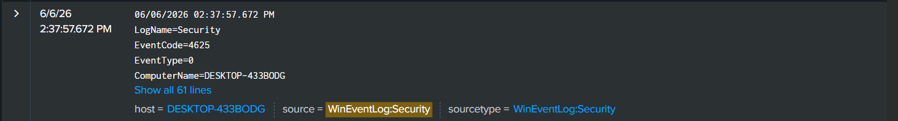
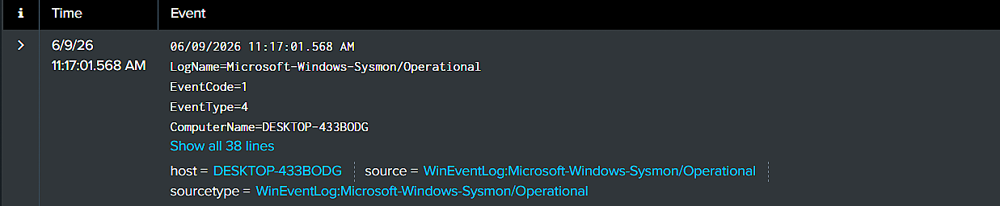
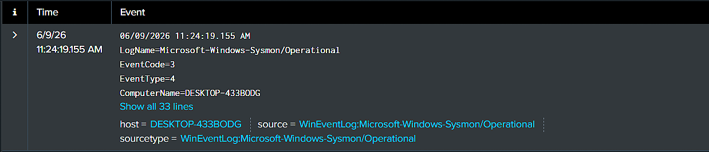
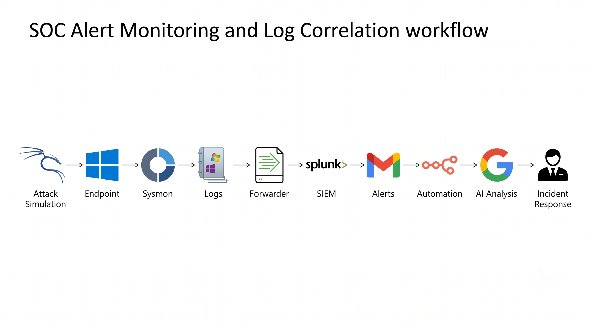

SOC Alert Monitoring and Log Correlation Using Splunk and Sysmon
Project Overview

This project demonstrates the implementation of a Security Operations Center (SOC) monitoring environment using Splunk Enterprise and Sysmon. Authentication, endpoint, and network logs were collected, monitored, and analyzed to detect suspicious activities. Three security alerts were created and correlated to reconstruct attacker-like behavior and demonstrate the SOC investigation workflow.
## Project Demonstration Video

🎥 Watch the complete SOC monitoring lab demonstration:

[Watch Demo Video](https://youtu.be/XK6TkDg8u2w)

## Technologies Used

* Splunk Enterprise
* Sysmon
* Splunk Universal Forwarder
* Windows 10
* Kali Linux
* n8n
* Google Gemini

## Architecture

The architecture consists of Kali Linux for attack simulation, Windows 10 as the monitored endpoint, Sysmon for endpoint telemetry, Splunk Universal Forwarder for log forwarding, and Splunk Enterprise for monitoring and alert generation.

## Security Alerts Implemented

### 1. Failed Login Detection

* Windows Event ID 4625
* Detects failed authentication attempts

### 2. System Information Enumeration

* Sysmon Event ID 1
* Detects execution of systeminfo.exe

### 3. PowerShell Network Reconnaissance

* Sysmon Event ID 3
* Detects PowerShell network activity

## Log Correlation

The correlated timeline demonstrates:

Failed Login → System Discovery → Network Reconnaissance

## Dashboard Monitoring

## AI-Powered Incident Reporting

Workflow:

## MITRE ATT&CK Techniques

- T1110 – Brute Force
- T1082 – System Information Discovery
- T1016 – System Network Configuration Discovery
- T1059.001 – PowerShell

## Skills Demonstrated

- SIEM Monitoring
- Splunk Search Processing Language (SPL)
- Sysmon Configuration
- Security Alerting
- Log Correlation
- Incident Investigation
- Dashboard Development
- Security Automation
- AI-Assisted Incident Reporting

## Future Enhancements

- SOAR Integration
- Automated Ticket Creation
- Multi-Endpoint Monitoring
- Threat Intelligence Integration
- AI-Based Alert Prioritization

## Project Outcomes

* 3 Security Alerts Generated
* Security Monitoring Dashboard
* Log Correlation Investigation
* Email Notification System
* AI-Assisted Incident Reporting

## Author

Kadiyala Revanth Kumar

Cybersecurity Student | SOC Analyst Aspirant
